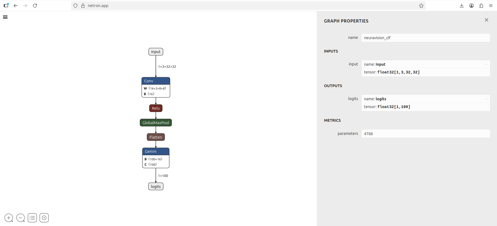
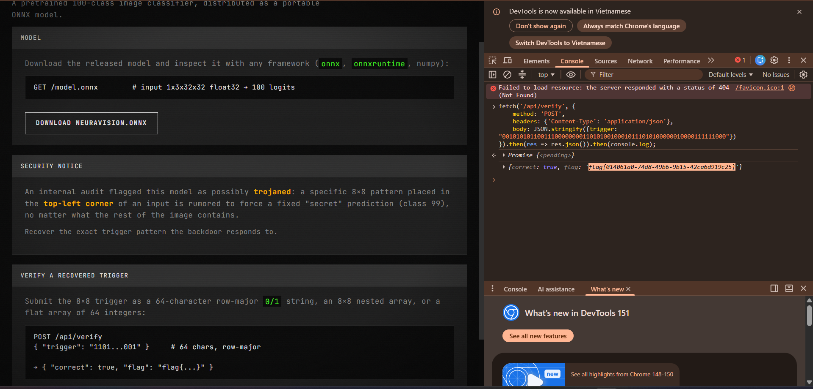

# [DDC CTF 2026] Reverse Challenge 3

## THÔNG TIN BÀI CHALLENGE
- Category: Reverse Engineering
- Target File: neuravision.onnx
- Objective: Hệ thống nội bộ cảnh báo mô hình này đã bị cấy mã độc (Trojaned/Backdoor). Một mẫu pixel 8×8 (Trigger) ở góc trái màn hình sẽ ép mô hình luôn dự đoán kết quả là Class 99 bất chấp nội dung bức ảnh là gì. Nhiệm vụ là dịch ngược mô hình và trích xuất chuỗi nhị phân 64-bit của Trigger này.

## CÔNG CỤ SỬ DỤNG
- Công cụ Netron: Phân tích tĩnh
- Python: Viết kịch bản phụ trợ để giải quyết bài toán

## QUÁ TRÌNH PHÂN TÍCH
### Bước 1: Phân tích tĩnh (Static Analysis)
 
Phân tích kiến trúc mạng nơ-ron thông qua Netron, mô hình bao gồm các lớp chính:
1. `Input`: Ảnh đầu vào kích thước 32×32 pixels, 3 kênh màu (RGB).
2. `Conv` (Convolution): Lớp tích chập chứa 16 bộ lọc (Filters). Kích thước mỗi bộ lọc là 3×8×8. Kích thước 8×8 này hoàn toàn khớp với kích thước của mã độc (Trigger) được nhắc đến trong đề bài.
3. `GlobalMaxPool`: Lớp này trích xuất đặc trưng lớn nhất từ các bộ lọc trên toàn bức ảnh, giúp Trigger hoạt động dù nằm ở bất kỳ đâu (đặc biệt là góc trên cùng bên trái).
4. `Gemm` (Fully Connected / Linear): Lớp quyết định, nhận 16 đặc trưng từ lớp Conv và chấm điểm cho 100 Classes.

### Bước 2: Phân tích động (dynamic Analysis)
Mục tiêu là tìm ra con đường (pathway) nào ép mô hình dự đoán ra Class 99.

Thay vì phân tích dữ liệu động, ta sử dụng phương pháp Weight Inspection (Kiểm tra trọng số):

Trích xuất ma trận trọng số của lớp `Gemm` (kích thước 100×16). Tại hàng thứ 99 (tương ứng với Class 99), ta phân tích 16 trọng số kết nối từ lớp Conv truyền tới.

**Kết quả:**

15 bộ lọc có trọng số dao động ở mức tiệm cận 0 (ví dụ: -0.06, 0.03). Riêng Bộ lọc số 00 (Filter 0) có trọng số dương cực kỳ lớn: 30.0000.

-> Kết luận: Filter 0 chính là Kẻ nội gián (Trojan). Khi Filter 0 bắt được Trigger, nó sẽ khuếch đại tín hiệu lên cực đại và ép lớp Gemm chọn Class 99

### Bước 3: Solution
Do nguyên lý của phép Tích vô hướng (Dot Product) trong Convolution, để đạt giá trị lớn nhất, ma trận trọng số của Filter 0 phải có hình dáng tỷ lệ thuận với bức ảnh Trigger.
1. Trích xuất Tensor của Filter 0 từ lớp Conv (kích thước 3×8×8).
2. Tính trung bình cộng (Mean) 3 kênh màu RGB để quy về ảnh xám (Grayscale).
3. Áp dụng Threshold (Ngưỡng): Trọng số >0 chuyển thành bit 1 (Pixel sáng), trọng số ≤0 chuyển thành bit `0` (Pixel tối). Ta thu được mảng Binary mask 8×8.
4. Làm phẳng (Flatten) mảng thành chuỗi 64 ký tự.
5. Sử dụng Fetch API (Console Browser) để gửi chuỗi này qua phương thức POST lên endpoint `/api/verify` và nhận cờ.

### Bước 4: Script
1. Script Python trích xuất Trigger:
    ```Python
    import onnx
    from onnx import numpy_helper
    import numpy as np

    # Load Model và tóm ma trận Conv
    model = onnx.load("neuravision.onnx")
    conv_weight = next(numpy_helper.to_array(i) for i in model.graph.initializer if "conv" in i.name.lower() or i.name == "W")

    # Lấy Filter 0 (Kẻ nội gián)
    traitor_filter = conv_weight[0]

    # Chuyển đổi RGB sang Binary Mask 8x8
    avg_filter = np.mean(traitor_filter, axis=0)
    binary_trigger = (avg_filter > 0).astype(int)

    # Khôi phục Payload 64-bit
    trigger_string = "".join(str(x) for x in binary_trigger.flatten())
    print("[+] Trigger Payload:", trigger_string)
    # Output: 0010101011001110000000011010100100010111010100000010000111111000
    ```

2. Payload Web (Javascript - Browser Console):
    ```JavaScript
    fetch('/api/verify', {
        method: 'POST',
        headers: {'Content-Type': 'application/json'},
        body: JSON.stringify({trigger: "0010101011001110000000011010100100010111010100000010000111111000"})
    }).then(res => res.json()).then(console.log);
    ```
## KẾT QUẢ:


## BÀI HỌC RÚT RA
Model Poisoning / Backdoor Attack: Đây là mối đe dọa thực tế đối với các tổ chức sử dụng AI. Việc tải các mô hình Pre-trained (như từ HuggingFace) về sử dụng mà không qua kiểm duyệt có thể dẫn đến việc rước Trojan vào nhà. Kẻ tấn công có thể thao túng kết quả nhận diện

---
Author: Dang Lam My Khanh