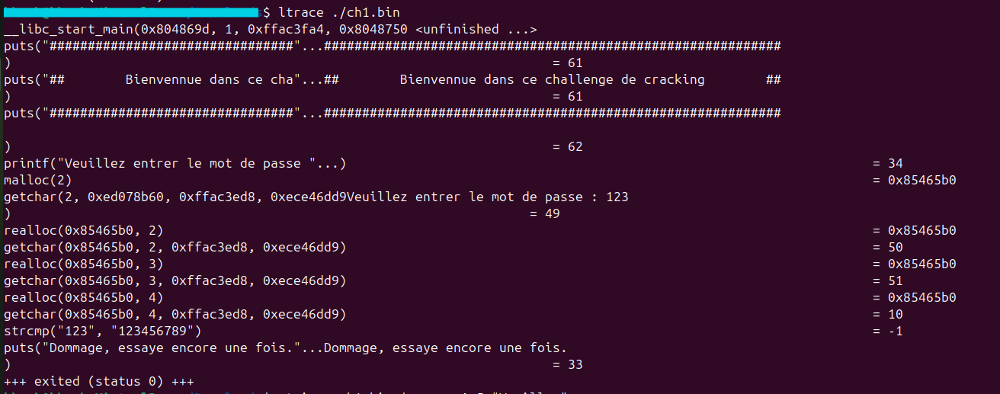

# [Root-Me] Cracking: ELF x86 - 0 Protection

## THÔNG TIN BÀI CHALLENGE
- Category: Cracking 
- Target File: ch1.bin
- Architecture: ELF 32-bit LSB (Intel 80386)
- Difficulty: Very Easy
- Mục tiêu: Phân tích logic kiểm tra mật khẩu của file thực thi và trích xuất Flag.

## CÔNG CỤ SỬ DỤNG
- CLI Tools: file, strings, objdump (Sơ bộ và phân tích tĩnh)
- Dynamic Analysis: ltrace (Theo dõi Library Calls)
- Environment: Linux x86_64 với gói tương thích libc6:i386

## QUÁ TRÌNH PHÂN TÍCH
### Bước 1: Kiểm tra sơ bộ (Reconnaissance)
Sử dụng lệnh file để xác định định dạng tệp tin:
```bash
$ file ch1.bin
ch1.bin: ELF 32-bit LSB executable, Intel 80386, version 1 (SYSV), dynamically linked, interpreter /lib/ld-linux.so.2, for GNU/Linux 2.6.9, not stripped
```
Nhận định: File này là kiến trúc 32-bit, được liên kết động (dynamically linked) và not stripped. Điều này có nghĩa là các ký hiệu hàm (Symbol names) như main, strcmp, printf vẫn còn giữ nguyên, giúp dịch ngược dễ dàng.

### Bước 2: Phân tích tĩnh (Static Analysis)
Sử dụng objdump để xem mã máy của hàm main:
``` nasm
0804869d <main>:
...
80486eb:    call   80485fe <getString>    ; Nhận chuỗi từ người dùng
80486f0:    mov    DWORD PTR [ebp-0xc],eax ; Lưu input vào Stack
...
8048712:    call   80484e8 strcmp@plt    ; So sánh input với mật khẩu gốc
```
Logic: Chương trình nhận đầu vào qua một hàm tùy chỉnh getString, sau đó đẩy (push) cả input của người dùng và mật khẩu gốc vào Stack để làm đối số cho hàm strcmp. Nếu hàm này trả về 0 (khớp), người dùng sẽ vượt qua thử thách.

### Bước 3: Phân tích động (Dynamic Analysis)
Để xác nhận mật khẩu mà không cần đọc sâu vào Assembly, sử dụng ltrace để bắt các lời gọi hàm thư viện tại thời điểm thực thi.
```bash
$ ltrace ./ch1.bin
```


Kết quả: ltrace tiết lộ hàm strcmp đang so sánh chuỗi tôi nhập vào (123) với chuỗi đích là 123456789.

## KẾT QUẢ
Flag: 123456789

## BÀI HỌC RÚT RA
- Dấu hiệu Hardcoded: Việc lưu trữ thông tin nhạy cảm dưới dạng Plain-text trong mã nguồn (đặc biệt là trong vùng .rodata) là một lỗi bảo mật sơ đẳng nhưng phổ biến.
- Sức mạnh của ltrace: Đối với các chương trình liên kết động và không có cơ chế chống phân tích (Anti-debugging/Anti-ltrace), ltrace là cách nhanh nhất để lấy thông tin từ các hàm so sánh chuỗi.
- Tầm quan trọng của Symbol Table: Một file "not stripped" cung cấp quá nhiều thông tin cho Reverser. Trong thực tế, các phần mềm thương mại luôn thực hiện strip để xóa bỏ tên hàm nhằm gây khó khăn cho việc dịch ngược.
- Môi trường (Environment): Luôn cần chuẩn bị sẵn các thư viện 32-bit (multiarch) khi làm việc trên hệ điều hành 64-bit hiện đại.

---
Author: Dang Lam My Khanh