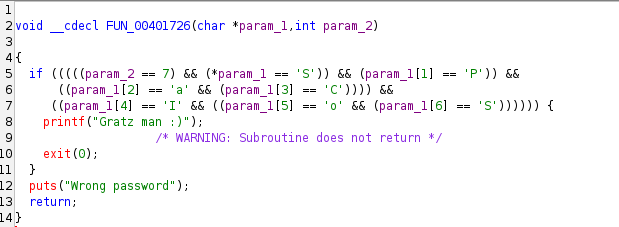

# [Root-Me] Cracking: PE x86 - 0 protection

## THÔNG TIN BÀI CHALLENGE
- Category: Cracking
- Target file: ch15.exe
- Architecture: PE32 (32-bit Console Application)
- Difficulty: Very Easy
- Mục tiêu: Tìm mật khẩu chính xác được truyền qua tham số dòng lệnh.

## CÔNG CỤ SỬ DỤNG
- CLI Tools: file, strings
- Stattic Analysis: Ghidra (decompiler)
- Compatibility Layer: Wine (để thực thi tệp PE Windows trên môi trường Linux)

## QUÁ TRÌNH PHÂN TÍCH
### Bước 1: Kiểm tra sơ bộ (Reconnaissance)
Sử dụng lệnh file để xác định định dạng tệp tin:
```bash
$ file ch15.exe
ch15.exe: PE32 executable (console) Intel 80386 (stripped to external PDB), for MS Windows, 7 sections
```
Nhận định:
- Đây là file 32-bit cho Windows
- Trạng thái "stripped to external PDB" cho thấy các ký hiệu debug (symbols) bị gỡ bỏ, nên sẽ thấy các hàm có tên mặc định như FUN_0040xxxx trong trình dịch ngược.

<br>
Khi chạy lệnh strings, kết quả trả về nhiều dòng:

```bash
$ strings ch15.exe
```
Xem xét sơ bộ phát hiện đoạn sau:
```bash
_set_invalid_parameter_handler
libgcj_s.dll
_Jv_RegisterClasses
Usage: %s pass
Gratz man :)
Wrong password
Unknown error
```

### Bước 2: Phân tích tĩnh với Ghidra (Static Analysis)
Tiến hành tìm kiếm chuỗi ký tự ("wrong"/"password") để định vị hàm kiểm tra mật khẩu. Sau khi lần theo các tham chiếu thì xác định được hàm logic tại địa chỉ 0x00401726.
<br>

Pseudo-code thu được:


**Phân tích thuật toán:**
- **Input Method:** Hàm nhận vào param_1 (con trỏ chuỗi) và param_2 (độ dài chuỗi) --> Mật khẩu được truyền qua đối số dòng lệnh (argv)
- **Length Check:** param_2 == 7 --> Mật khẩu phải dài đúng 7 kí tự
- **Manual Comparison:** Thay vì dùng strcmp, chương trình kiểm tra từng Byte một tại các Offset cụ thể.
- **Flag Extraction:** Ghép các kí tự lại, ta có chuỗi: SPaCIoS

### Bước 3: Xác minh động (Dynamic Verification)
Vì đây là file trên Windows, dùng **Wine** để thực thi trên Linux. Lần chạy đầu tiên cho thấy chương trình cần tham số:
```bash
$ wine ch15.exe
Usage: Z:\...ch15.exe pass
```
Tiến hành truyền mật khẩu đã tìm được vào dòng lệnh:
```bash
$ wine ch15.exe SPaCIoS
Gratz man :)
```

## KẾT QUẢ
Flag: SPaCIoS

## BÀI HỌC RÚT RA
- **Manual String Comparison:** Lập trình viên có thể né tránh việc bị paht1 hiện bởi các công cụ như ```ltrace``` bằng cách viết logic so sánh từng kí tự (```if (str[i] == 'x')```). Điều này buộc Reverser phải đọc code Assembly/Decompiler kỹ hơn.
- **Command Line Arguments:** Không phải lúc nào input cũng được nhận qua stdin (phím Enter sau khi chạy). Việc kiểm tra cách chương trình nhận tham số (argv) là bước quan trọng trong Windows RE.
- **Non-returning Functions:** Việc sử dụng ```exit(0)``` thay vì ```return``` làm ngắt luồng điều khiển thông thường. Ghidra cảnh báo *"Subroutine does not return"* để lưu ý Reverser rằng các mã nguồn phía sau lệnh này sẽ bị cô lập (dead code) (luồng rõ ràng, hoặc là đúng (in ra 'Gratz' và Thoát), hoặc là sai (in ra 'Wrong' và Thoát), không có sự nhập nhằng)
- **Cross-platform Analysis:** Dùng Wine là 1 giải pháp hiệu quả để phân tích nhanh các tệp tin Windows PE trên máy ảo Linux mà không cần dùng đến môi trường Windows thực tế.

---
Author: Dang Lam My Khanh